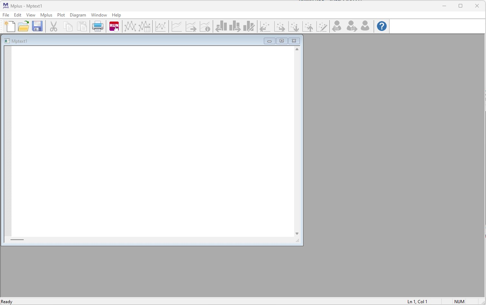
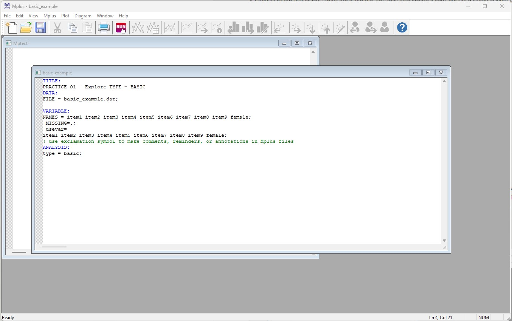
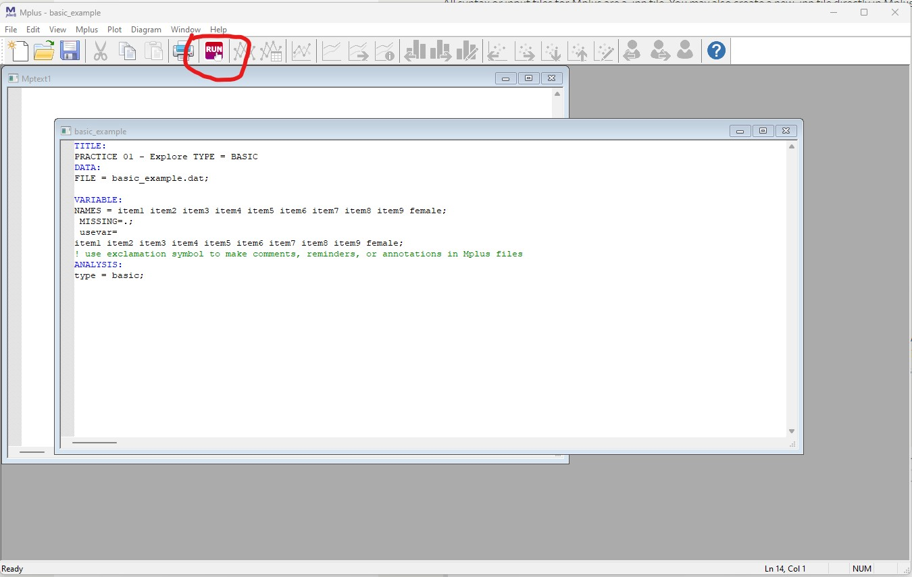

```{r, echo=FALSE}
htmltools::img(src = knitr::image_uri(file.path("figures/mm4dber_white.jpg")), 
               alt = 'logo', 
               style = 'position:absolute; top:0; right:0; padding:10px;',
               width ="250",
               height ="193")
```

```{r setup, include=FALSE}
knitr::opts_chunk$set(echo = TRUE, warning = FALSE, message = FALSE,
                      tidy.opts=list(width.cutoff=60))
```

# --------------------------------------------------------------------------------------


```{r, echo=FALSE, out.width='35%', fig.align='center'}

```

# --------------------------------------------------------------------------------------

Mixture Modeling for Discipline Based Education Researchers (MM4DBER) is an NSF funded training grant to support STEM Education scholars in integrating mixture modeling into their research.

-   Please [visit our website](https://mm4dbers.education.ucsb.edu/) to learn more and apply for the year-long fellowship.

-   Follow us on [Twitter](https://twitter.com/mm4dbers)!

Visit our [GitHub](https://github.com/MM4DBER/intro-to-rstudio) account to download the materials needed for this walkthrough.

# --------------------------------------------------------------------------------------

# Introduction to `Mplus`

Exercise: Walk through how to run basic descriptive statistics using the Mplus program.

Learning objective: To understand how Mplus syntax works and, in preparation for future exercises, be able to differentiate `R` from `Mplus` syntax.

### Step 1: Open Mplus



**Mplus interface:** Even though we will **NOT** be working directly in Mplus, it is good to get an idea of how Mplus works.

# --------------------------------------------------------------------------------------

### Step 2: Open Mplus input file located in the project folder



- Open the file titled `basic_example.inp` located in the `mplus_files` folder in Mplus.
- All syntax or input files for Mplus are a *.inp* file.
- You may also create a new *.inp* file directly in Mplus and populate the syntax there.
- For now, we can use one that is already complete.

# --------------------------------------------------------------------------------------

### Basic outline of an Mplus *.inp* file:

-   **TITLE:** Title of document goes here

-   **DATA:** Data file name (must be in the same folder as the *.inp*)

-   **VARIABLE:**

    -   **NAMES =** Names of each variable in order of each column (separated by spaces)

    -   **MISSING** = What the missing data is labeled as (e.g., 999)

    -   **USEVAR =** Names of the variable used in the analysis

-   **ANALYSIS:**

    -   **TYPE =** This line of sytax will change based on model type. Here we are running `type = basic` which will provide descriptive statistics for variables specified in the `USEVAR = ` statement.
    
# --------------------------------------------------------------------------------------

**NOTE:** Please view the data file that is provided in this walkthrough (`basic_example.dat`).
Mplus works with .dat files to run analyses.

The data file (`.dat`) must also be formatted in certain way in order for Mplus to read it (i.e., no variable names or strings, only numbers).

For more information on Mplus commands, see [here](https://stats.oarc.ucla.edu/mplus/seminars/mplus-class-notes/getting-started-with-mplus/).

# --------------------------------------------------------------------------------------

### Step 3: Click Run



This will run our "type=basic" analysis which will provide us an *.out* file that contains variables descriptive statistics of our variables. 

For information on the `type=basic` output, see [here](https://stats.oarc.ucla.edu/mplus/seminars/mplus-class-notes/exploring/).

Mplus will save this *.out* file in the folder that dataset is located (in our case `part1_mplus`. All *.out* and *.inp* files can be open as a text file if you want to access them off without Mplus.


# --------------------------------------------------------------------------------------


